# Hauskreis-App – Backend-Umsetzungsplan

## Kontext

`CLAUDE.md` beschreibt den fachlichen Bedarf für eine PWA, die die Organisation eines 9-köpfigen Hauskreises übernimmt (Host-Findung, Themen, Songs, Gebetsbuddys, Actionsteps), aktuell komplett über WhatsApp gelöst und dadurch unübersichtlich. Das Repo ist aktuell **komplett leer** (kein Code, kein Git, kein Supabase-Projekt) – nur `CLAUDE.md` und ein leerer Platzhalter-Ordner `hauskreis-backend/` existieren. Es handelt sich also um eine Neuanlage von Grund auf.

Ziel dieses Plans: das Backend **modular** aufbauen, dass jedes der in CLAUDE.md beschriebenen Features (Host, Thema, Song, Gebetsbuddy, Actionstep) nach demselben Baukasten funktioniert – damit neue Features später ergänzt werden können, ohne bestehenden Code/Datenmodell umzubauen.

**Umfang:** Nur Backend. Next.js-Frontend ist explizit **nicht** Teil dieses Plans (separates/späteres Vorhaben). Das Repo ist inzwischen als Git-Repository initialisiert und wird künftig **Backend und Frontend gemeinsam** verwalten (Monorepo); der gesamte Code dieses Plans entsteht ausschließlich innerhalb von `hauskreis-backend/`.

**Wichtige Kurskorrektur während der Planung:** Ursprünglich war Supabase (managed Postgres+Auth+PostgREST+Edge Functions) vorgesehen. Nach Rückfrage hat sich herausgestellt, dass das nicht das gewünschte Setup ist – stattdessen entsteht ein **komplett eigener Backend-Server** (Node.js + TypeScript + **NestJS**) mit **Keycloak** als Identity-Provider und eigener Postgres-Datenbank (via **Prisma**). Das Datenmodell (ER-Diagramm) bleibt inhaltlich identisch, nur die technische Umsetzung (kein RLS/PostgREST, sondern eigene Guards/Module/Services) ändert sich.

### Klärende Rückfragen & Entscheidungen (bereits mit dir abgestimmt)

| Frage | Entscheidung |
|---|---|
| Multi-Tenancy | Datenmodell wird **multi-group-fähig** gebaut (eigene `hauskreis`-Tabelle + `hauskreis_id` auf allen Kern-Tabellen), auch wenn aktuell nur eine Gruppe existiert |
| Rollen/Rechte | Es gibt eine **Admin-Rolle** (z. B. Gebetsbuddy-Zyklus ändern, Mitglieder entfernen); die meisten übrigen Funktionen sind für alle Mitglieder offen. Rollen leben als **Keycloak-Realm-Rollen** (im Access-Token), nicht dupliziert in der DB |
| Auth | **Keycloak** als Identity-Provider (nicht Supabase Auth), Invite-Flow über Keycloaks Admin-API (kein Passwort-Vorabversand, E-Mail-Einladung) |
| Gebetsbuddy-Fairness | Wiederholungs-Vermeidung nötig – Rotation muss Historie berücksichtigen, damit sich Paare nicht zu schnell wiederholen |
| Backend-Framework | **NestJS** (TypeScript, eingebautes Modul-/DI-System – Modularität wird vom Framework selbst erzwungen, nicht nur per Konvention) auf Node.js/Express, gehostet auf einem dedizierten Node-Host (Railway/Fly.io/Render), da Keycloak einen dauerhaft laufenden Prozess braucht (nicht mit Vercel Serverless kompatibel) |
| ORM | **Prisma** (ursprüngliche Wahl, mit NestJS das gängigere Pairing – ausgereifte Migrations, Type-Safety, gute NestJS-Integration) |

---

## Architektur-Grundprinzipien (damit später nichts bricht)

1. **`hauskreis` statt `group`** als Tenant-Tabelle: `group` ist reserviertes SQL-Keyword (`GROUP BY`) und hätte in jeder Query gequotet werden müssen – vermeidbare Fehlerquelle.
2. **`person` statt `user`**: eigene Domain-Tabelle für Fakten wie `plays_instrument`/`can_host`/`birthdate`, getrennt von der Identität. `person.keycloak_user_id` (nullable, reine String-Referenz auf Keycloaks `sub`-Claim, kein DB-FK möglich, da Keycloak eine externe Nutzerverwaltung ist) wird erst beim ersten Login gesetzt – dadurch kann ein Admin eine Person **anlegen, bevor sie sich je eingeloggt hat** (wichtig für Gebetsbuddy-Zuteilung etc. vor Annahme der Einladung).
3. **Ein wiederverwendbarer Vorschlags-Baustein statt 4 Spezial-Lösungen:** Host-, Themen- und Song-Zuteilung folgen alle demselben Muster ("wer hat das zuletzt am längsten nicht gemacht"). Statt das für jedes Feature einzeln zu bauen, entsteht ein eigenes **`RoleSuggestionModule`**, das Zuweisungs-Events aus Host/Thema/Song normalisiert zusammenführt (ein gemeinsamer `RoleAssignmentEvent`-Typ) und darauf eine einzige Ranking-Funktion anwendet. Andere Module (`MeetingModule`, `TopicModule`, `SongModule`) importieren diesen `RoleSuggestionService` einfach über NestJS' `imports`/`exports`-Mechanismus. Ein neues "Zuteilungs-Feature" in der Zukunft bedeutet: **einen weiteren Event-Adapter ergänzen**, nicht die Ranking-Logik neu schreiben.
4. **Gebetsbuddy-Rotation ist bewusst kein Teil dieses Bausteins** – es ist ein paarweises Gruppierungsproblem (nicht "eine Person pro Slot"), daher ein eigener Service im `PrayerBuddyModule`, der auf derselben Grundidee (Historie = Fairness-Basis) aufbaut, aber strukturell anders ist.
5. **Rollen/Autorisierung zentral über Guards**: ein globaler `AuthGuard` verifiziert das Keycloak-Access-Token einmal pro Request und stellt Identität + Rollen (`member`/`admin`) im Request-Context bereit; ein `@Roles('admin')`-Decorator + `RolesGuard` wird darauf für admin-only Routen wiederverwendet – vermeidet, dass Rollenprüfung in jedem Controller dupliziert wird. Empfehlung: das Community-Paket **`nest-keycloak-connect`** (baut auf Keycloaks offiziellem `keycloak-connect`-Adapter auf, liefert `AuthGuard`/`RoleGuard`/`@Roles()` direkt für NestJS) – alternativ ein eigener, schlanker Guard mit `jose`/JWKS, falls das Paket zu unflexibel ist.
6. **Enums statt Freitext** für alle Status-/Typ-Felder (`meeting_type`, `meeting_status`, `attendance_status`, `notification_type`) – in Prisma als native `enum` im Schema. Neue Werte später per Migration ergänzen – nicht-brechende Erweiterung.
7. **Ein Feature = ein NestJS-Modul** (`src/<feature>/<feature>.module.ts` mit Controller/Service/DTOs): jedes Feature (hauskreis, person, meeting, topic, song, prayer-buddy, notification, role-suggestion) ist in sich geschlossen; Abhängigkeiten zwischen Modulen sind über `imports`/`exports` **explizit sichtbar** – das DI-System von NestJS erzwingt die Modul-Grenzen, statt sie nur als Konvention vorzuschlagen.
8. **Ein gemeinsames `NotificationModule`** (Push-Versand via `web-push` + `notification_log`-Dedup, `NotificationService` exportiert), das von allen Scheduled-Job-Services importiert wird – neue Reminder-Arten später brauchen nur einen neuen Aufrufer, keine neue Push-Implementierung.
9. **Join-Tabellen ohne eigene `hauskreis_id`**: Scope wird transitiv über die Parent-FK (z. B. `meeting_id → meeting.hauskreis_id`) abgeleitet – vermeidet Redundanz/Anomalien; bei 9 Nutzer:innen ist die Performance dafür irrelevant.
10. **Scheduled Jobs laufen in-process** über `@nestjs/schedule` (`@Cron()`-Decorator direkt auf injectable Services, z. B. `MeetingGeneratorService`) – DI-fähig (Zugriff auf Prisma/NotificationService), da der Server dauerhaft läuft (kein Serverless).

---

## ER-Diagramm (alle Kern-Entitäten)

```mermaid
erDiagram
    hauskreis ||--o{ person : has
    hauskreis ||--o{ location : has
    hauskreis ||--o{ meeting : has
    hauskreis ||--o{ topic : has
    hauskreis ||--o{ song : has
    hauskreis ||--o{ prayer_buddy_group : has
    hauskreis ||--o{ absence_period : has
    hauskreis ||--|| prayer_buddy_cycle_config : configures

    person ||--o{ meeting : "hosts (nullable)"
    location ||--o{ meeting : "hosted_at (nullable)"
    topic ||--o{ meeting : "assigned_to (nullable)"

    meeting ||--o{ meeting_attendance : has
    person ||--o{ meeting_attendance : attends

    topic ||--o{ topic_responsible : has
    person ||--o{ topic_responsible : responsible_for

    meeting ||--o{ meeting_song_leader : has
    person ||--o{ meeting_song_leader : leads

    meeting ||--o{ meeting_song : has
    song ||--o{ meeting_song : picked_in
    person ||--o{ meeting_song : suggested
    person ||--o{ song : created

    prayer_buddy_group ||--o{ prayer_buddy_group_member : has
    person ||--o{ prayer_buddy_group_member : member_of

    person ||--o{ absence_period : declares
    person ||--o{ push_subscription : has
    person ||--o{ notification_log : receives
    meeting ||--o{ notification_log : "related_to (nullable)"

    hauskreis {
        uuid id PK
        text name
        timestamptz created_at
    }

    person {
        uuid id PK
        uuid hauskreis_id FK
        text keycloak_user_id "nullable, String-Ref auf Keycloak sub-Claim, gesetzt bei erstem Login, kein DB-FK"
        text name
        text email
        date birthdate "nullable"
        bool plays_instrument
        bool can_host
        bool active
        timestamptz created_at
    }

    location {
        uuid id PK
        uuid hauskreis_id FK
        text name
        numeric frequency_factor
        bool requires_host "false z.B. bei Schlosspark/draussen"
        bool active
    }

    meeting {
        uuid id PK
        uuid hauskreis_id FK
        date date
        meeting_type type "standard | lobpreis_gebet | custom"
        meeting_status status "planned | cancelled | completed"
        uuid location_id FK "nullable"
        uuid host_person_id FK "nullable"
        uuid topic_id FK "nullable"
        text title "nullable, fuer custom Termine"
        text testimony_text "nullable, nur lobpreis_gebet"
        text actionstep_text "nullable"
        text summary_text "nullable"
        text info_text "nullable"
        timestamptz created_at
        timestamptz updated_at
    }

    meeting_attendance {
        uuid meeting_id FK
        uuid person_id FK
        attendance_status status "attending | absent | unknown"
    }

    topic {
        uuid id PK
        uuid hauskreis_id FK
        text title "nullable"
        topic_status status "running | completed"
        timestamptz created_at
    }

    topic_responsible {
        uuid topic_id FK
        uuid person_id FK
    }

    song {
        uuid id PK
        uuid hauskreis_id FK
        text title
        text artist "nullable"
        text lyrics_url "nullable"
        uuid created_by_person_id FK
        timestamptz created_at
    }

    meeting_song_leader {
        uuid meeting_id FK
        uuid person_id FK
    }

    meeting_song {
        uuid id PK
        uuid meeting_id FK
        uuid song_id FK
        uuid suggested_by_person_id FK
        bool is_selected
        timestamptz created_at
    }

    prayer_buddy_cycle_config {
        uuid id PK
        uuid hauskreis_id FK
        int period_length_weeks "default 2"
        uuid updated_by_person_id FK
        timestamptz updated_at
    }

    prayer_buddy_group {
        uuid id PK
        uuid hauskreis_id FK
        date period_start
        date period_end
        timestamptz created_at
    }

    prayer_buddy_group_member {
        uuid prayer_buddy_group_id FK
        uuid person_id FK
    }

    absence_period {
        uuid id PK
        uuid hauskreis_id FK
        uuid person_id FK
        date start_date
        date end_date
        text reason "nullable"
        timestamptz created_at
    }

    push_subscription {
        uuid id PK
        uuid person_id FK
        text endpoint
        text p256dh_key
        text auth_key
        text user_agent "nullable"
        timestamptz created_at
    }

    notification_log {
        uuid id PK
        uuid person_id FK
        notification_type type
        uuid related_meeting_id FK "nullable"
        timestamptz sent_at
    }
```



**Hinweis:** `person.keycloak_user_id` referenziert eine bei Keycloak (separates System, nicht Teil dieses Diagramms) verwaltete Identität – wird erst beim ersten Login gesetzt (Invite-Flow, siehe Phase 1). Rollen (`member`/`admin`) werden **nicht** in `person` gespeichert, sondern als Keycloak-Realm-Rollen im Access-Token mitgeliefert.

**Nicht als Tabelle, sondern als Service-Logik in TypeScript** (bewusst kein Datenduplikat, siehe Prinzip 3):
- `roleSuggestionService` – normalisiert Host-, Themen- und Song-Zuweisungen zu einem gemeinsamen `RoleAssignmentEvent`-Typ (Basis für Vorschlagslogik) und rankt Personen danach (letzter Termin, Anzahl, Eligibility)
- `locationSuggestionService` – analog, aber für Locations (Nutzungs-Historie × `frequency_factor`)
- Archiv-Endpunkte (Phase 10) für vergangene Termine/Themen/Songs, read-only

**Out of scope für dieses Diagramm** (siehe Backlog): Geschenke-Koordination, Essen/TGTG-Vertretung – bewusst nicht modelliert, das Schema-Muster (hauskreis-scoped Tabelle + person-FKs) lässt sich aber später ohne Bruch ergänzen.

---

## Tech-Stack (Backend)

| Bereich | Wahl |
|---|---|
| Sprache/Runtime | TypeScript auf Node.js (LTS) |
| Web-Framework | **NestJS** (Express-Adapter, NestJS-Standard) |
| ORM/Migrationen | **Prisma** (`prisma migrate`) |
| Datenbank | PostgreSQL (managed Add-on beim gewählten Host oder separater Anbieter) |
| Auth/Identity | Keycloak (eigener Container), Integration via `nest-keycloak-connect` (Guards/Decorators auf Basis des offiziellen `keycloak-connect`-Adapters) |
| Validierung | **Zod** (nicht class-validator) über `nestjs-zod`, global registrierte `ZodValidationPipe` – Details siehe unten |
| Config | `@nestjs/config` mit **Zod**-Schema-Validierung der Env-Variablen (statt Joi, konsistent mit Request-Validierung) |
| Logging | `nestjs-pino` (strukturiertes JSON-Logging, request-scoped) |
| Security-Headers/CORS/Kompression | `helmet`, `compression`, `cors` – offizieller NestJS-Security-Guide-Standard, per `app.use(...)` in `main.ts` |
| Rate-Limiting (optional) | `@nestjs/throttler` – nicht kritisch bei 9 Nutzer:innen, aber güns­tig ergänzbar |
| Scheduled Jobs | `@nestjs/schedule` (`@Cron()`-Decorator, DI-fähig) |
| Push-Versand | `web-push` (VAPID) |
| Testing | Jest (NestJS-Standard) + `@nestjs/testing` (`Test.createTestingModule()`), optional Testcontainers für DB/Keycloak-Integrationstests |
| Lokale Entwicklung | Docker Compose (Postgres + Keycloak + API) |
| Hosting | Dedizierter Node-Host (Railway/Fly.io/Render) – nötig, da Keycloak einen dauerhaft laufenden Prozess braucht |

### Validierungs-Ansatz: Zod statt class-validator

NestJS ist standardmäßig auf `class-validator`/`class-transformer` ausgelegt, unterstützt aber laut eigener Dokumentation genauso gut schema-basierte Validierung (Zod wird dort explizit als Beispiel genannt) – das lässt sich sauber und **global** umsetzen:

- **Paket:** [`nestjs-zod`](https://www.npmjs.com/package/nestjs-zod) – erspart eigenen Boilerplate, bietet `createZodDto()` und eine passende `ZodValidationPipe`, plus optionale Swagger/OpenAPI-Generierung direkt aus den Zod-Schemas.
- **Ein Schema pro Request-Form**, z. B. `const CreateMeetingSchema = z.object({ date: z.coerce.date(), locationId: z.string().uuid().optional(), ... })`. Die DTO-Klasse ist nur ein dünner Wrapper: `class CreateMeetingDto extends createZodDto(CreateMeetingSchema) {}` – Zod bleibt die **einzige Quelle der Wahrheit** für Laufzeit-Validierung *und* den TypeScript-Typ (`z.infer<...>`), es gibt keine zwei getrennten Deklarationen wie bei class-validator (Decorator-Regeln vs. Typ), die auseinanderlaufen könnten.
- **Globale Pipe:** ja, sinnvoll – einmal in `AppModule` registrieren:
  ```ts
  providers: [{ provide: APP_PIPE, useClass: ZodValidationPipe }]
  ```
  Das funktioniert global, weil `createZodDto()` dem erzeugten DTO das Schema als statische Property anhängt; die Pipe erkennt es über den `metatype`-Parameter, den Nest jeder Pipe mitgibt – exakt derselbe Mechanismus, den Nests eingebaute `ValidationPipe` für class-validator-DTOs nutzt. Dadurch braucht **kein** Controller ein `@UsePipes(...)` pro Route; `@Body() dto: CreateMeetingDto` reicht.
  Der Mechanismus funktioniert identisch für `@Query()`/`@Param()`-DTOs (z. B. Filter-Query-Parameter bei Archiv-Endpunkten in Phase 10).
- **Fehlerformat:** Ein globaler `HttpExceptionFilter` (Phase 0) formt `ZodError` in eine konsistente 400-Antwort (Feld → Fehlermeldung) um – einmal zentral, nicht pro Route.
- **Konsistenz:** Env-Variablen-Validierung (`@nestjs/config`) nutzt dieselbe Zod-Schema-Bibliothek (`ConfigModule.forRoot({ validate: (config) => EnvSchema.parse(config) })`) – eine einzige Validierungs-Bibliothek im ganzen Projekt statt Zod + Joi nebeneinander.

---

## Phasenplan

Jede Phase ist einzeln migrierbar/testbar und baut auf der vorherigen auf. Reihenfolge ist so gewählt, dass (a) die größten WhatsApp-Schmerzpunkte (Host-Findung, Erinnerungen) zuerst nutzbar werden und (b) die Vorschlags-Engine schon beim 2. und 3. Feature (Thema, Song) ihre Wiederverwendbarkeit beweist, bevor strukturell andere Features (Gebetsbuddy) kommen.

**Phase 0 – Projekt-Fundament**
- NestJS-Projekt-Setup (`nest new`, Express-Adapter) in `hauskreis-backend/`
- Docker Compose für lokale Entwicklung: Postgres-Container + Keycloak-Container + API
- Prisma-Setup (`schema.prisma`, `prisma migrate dev`)
- Basis-Setup in `main.ts`: `helmet`, `compression`, `cors`, global registrierte `ZodValidationPipe` (`nestjs-zod`), globaler `HttpExceptionFilter` (formt `ZodError` in konsistente 400-Antworten um), `nestjs-pino`-Logging
- `ConfigModule` (`@nestjs/config`) mit Zod-Validierung der Env-Variablen (`validate: (config) => EnvSchema.parse(config)`)
- Grundstruktur: ein Root-`AppModule`, das pro Feature ein eigenes Modul importiert (siehe Ordnerstruktur)

**Phase 1 – Keycloak-Integration + `hauskreis`, `person`**
- Keycloak-Realm anlegen (z. B. "hauskreis"), API-Client konfigurieren, Realm-Rollen `member`/`admin` definieren
- `nest-keycloak-connect` einbinden: globaler `AuthGuard` (Token-Verifizierung) + `RoleGuard`/`@Roles('admin')`-Decorator für admin-only Routen
- Migration: `hauskreis`, `person` (mit `keycloak_user_id`, ohne `role`-Spalte) im Prisma-Schema
- Invite-Endpoint (`@Roles('admin')`): ruft Keycloaks Admin-REST-API auf (Nutzer anlegen + Einladungs-Mail/Required-Action auslösen), legt parallel `person`-Zeile mit `keycloak_user_id = null` an
- Verknüpfung: beim ersten Login wird `keycloak_user_id` auf die passende `person`-Zeile (E-Mail-Match) gesetzt

**Phase 2 – Meetings-Kern**
- Migration: `location`, `meeting` (+ Enums `meeting_type`, `meeting_status`), `meeting_attendance`
- `MeetingModule`: Controller + Service + DTOs für CRUD + Attendance
- `MeetingGeneratorService` mit `@Cron()` (täglich): stellt sicher, dass immer ≥ 7 zukünftige Termine existieren; erzeugt wöchentliche Dienstags-Standardtermine; ersetzt den letzten Termin vor Monatsende durch `lobpreis_gebet`; idempotent (überspringt Daten, an denen bereits ein Termin existiert, egal welchen Typs, damit manuelle `custom`-Termine nicht überschrieben werden)
- Autorisierung: Termine lesbar/schreibbar für alle Mitglieder (flache Rechte), Löschen admin-only

**Phase 3 – Push-Notification-Infrastruktur**
- Migration: `push_subscription`, `notification_log` (+ Enum `notification_type`)
- `NotificationModule` mit `NotificationService`: sendet Web Push (`web-push`) + schreibt `notification_log` zur Dedup, als Provider exportiert
- Diese Infrastruktur wird ab Phase 4 von jedem Reminder-Feature per DI importiert – deshalb bewusst früh statt nachträglich gebaut

**Phase 4 – Vorschlags-Engine + Host-Zuteilung**
- `RoleSuggestionModule`/`RoleSuggestionService` (zunächst nur Host-Adapter): sammelt `RoleAssignmentEvent[]` aus `meeting.host_person_id`, rankt Personen nach Historie + Eligibility (`can_host`, nicht abwesend)
- Analoger `LocationSuggestionService` für Location-Empfehlung (Frequenz-Gewichtung)
- `HostReminderService` mit `@Cron()` (täglich), injiziert `NotificationService`
- `MeetingModule` importiert `RoleSuggestionModule` (statt eigene Ranking-Logik zu duplizieren)

**Phase 5 – Themen-Zuteilung**
- Migration: `topic`, `topic_responsible` (+ Enum `topic_status`)
- Neuer Event-Adapter "topic" im `RoleSuggestionService` → Ranking-Logik bleibt unverändert; `TopicModule` importiert `RoleSuggestionModule`
- Auto-Vorbelegung: `MeetingGeneratorService` setzt `topic_id` des neuen Termins automatisch, solange das aktuelle Thema `status = 'running'` ist

**Phase 6 – Song-Datenbank + Song-Zuteilung**
- Migration: `song`, `meeting_song_leader`, `meeting_song`
- Neuer Event-Adapter "song" (Eligibility-Filter: `plays_instrument = true`)
- Volltextsuche/Autocomplete auf `song.title`/`artist` (Postgres `ILIKE`/`pg_trgm` via Prisma) für Vorschlags-Wiederverwendung

**Phase 7 – Gebetsbuddys**
- Migration: `prayer_buddy_cycle_config`, `prayer_buddy_group`, `prayer_buddy_group_member`
- `PrayerBuddyGeneratorService` mit `@Cron()` (im konfigurierten Rhythmus): berechnet aus der Historie eine "zuletzt zusammen gruppiert"-Matrix und bildet 2er-/3er-Gruppen mit minimalen Wiederholungen (Greedy-Heuristik reicht bei 9 Personen, kein Solver nötig); sendet Reminder über `NotificationService`
- `period_length_weeks` änderbar nur durch Admin (`@Roles('admin')`)

**Phase 8 – Actionsteps & Zusammenfassung**
- Keine neuen Tabellen (Felder existieren bereits auf `meeting` seit Phase 2)
- `ActionstepReminderService` mit `@Cron()` (wöchentlich), injiziert `NotificationService`

**Phase 9 – Abwesenheit & Termin-Absage**
- Migration: `absence_period`
- Rückwirkende, additive Erweiterung: `RoleSuggestionService`, `MeetingGeneratorService` und `PrayerBuddyGeneratorService` bekommen einen zusätzlichen Ausschluss-Filter für aktuell abwesende Personen – keine bestehende Logik wird umgebaut, nur ergänzt
- Termin-Absage: `meeting.status = 'cancelled'`

**Phase 10 – Archiv**
- Read-only Endpunkte (mit Pagination) für vergangene Termine, Themen, Songs

**Backlog (nicht Teil der Migrationen, aber schemakompatibel später ergänzbar):** Geschenke-Koordination, Essen/TGTG-Vertretung

---

## Vorgeschlagene Ordnerstruktur

```
hauskreis-backend/
  docker-compose.yml          # Postgres + Keycloak + API für lokale Entwicklung
  prisma/
    schema.prisma
    migrations/
  src/
    main.ts                    # Nest-Bootstrap: helmet/compression/cors, globale ZodValidationPipe, Filter
    app.module.ts               # Root-Modul, importiert alle Feature-Module
    config/
      configuration.ts          # @nestjs/config + Zod-Validierung
      env.schema.ts              # Zod-Schema für Env-Variablen
    common/
      guards/                   # RolesGuard (falls nicht vollständig durch nest-keycloak-connect abgedeckt)
      decorators/                # @Roles()
      filters/
        http-exception.filter.ts
    prisma/
      prisma.module.ts
      prisma.service.ts          # PrismaClient als injectable Provider
    hauskreis/
      hauskreis.module.ts
      hauskreis.controller.ts
      hauskreis.service.ts
    person/
      person.module.ts
      person.controller.ts
      person.service.ts          # inkl. Invite-Flow (Keycloak Admin API)
    meeting/
      meeting.module.ts
      meeting.controller.ts
      meeting.service.ts
      meeting-generator.service.ts   # @Cron
      dto/                        # Zod-Schemas + createZodDto()-Wrapper (z.B. create-meeting.dto.ts)
    topic/
    song/
    prayer-buddy/
      prayer-buddy.module.ts
      prayer-buddy.controller.ts
      prayer-buddy.service.ts
      prayer-buddy-generator.service.ts  # @Cron
    role-suggestion/              # geteiltes Modul, von meeting/topic/song importiert
      role-suggestion.module.ts
      role-suggestion.service.ts
    notification/
      notification.module.ts
      notification.service.ts     # Push + Dedup, exportiert für andere Module
```

## Verifikation je Phase

- Lokal: `docker compose up` (Postgres + Keycloak) + `prisma migrate dev`, Seed-Skript für Testdaten (9 Test-Personen, Test-Locations)
- Auth: Manuelle Token-Flows gegen die lokale Keycloak-Instanz (Login, Token-Verifizierung, `@Roles('admin')` mit Member- vs. Admin-Rolle testen)
- Modul-Tests: Jest + `@nestjs/testing` (`Test.createTestingModule()`) pro Modul, Controller/Service isoliert mit gemockten Dependencies testen
- Scheduled Jobs: `@Cron`-Services direkt (ohne Cron-Trigger) mit manuell gesetzten Testdaten aufrufen (z. B. Termine kurz vor Monatsende) und Ergebnis prüfen
- Vorschlags-Engine: `RoleSuggestionService` mit Testdaten aufrufen und Ranking gegen erwartete Reihenfolge prüfen
