# Hauskreis-App – Backend-Umsetzungsplan

## Kontext

`CLAUDE.md` beschreibt den fachlichen Bedarf für eine PWA, die die Organisation eines 9-köpfigen Hauskreises übernimmt (Host-Findung, Themen, Songs, Gebetsbuddys, Actionsteps), aktuell komplett über WhatsApp gelöst und dadurch unübersichtlich. Das Repo ist aktuell **komplett leer** (kein Code, kein Git, kein Supabase-Projekt) – nur `CLAUDE.md` und ein leerer Platzhalter-Ordner `hauskreis-backend/` existieren. Es handelt sich also um eine Neuanlage von Grund auf.

Ziel dieses Plans: das Backend (Supabase: Datenmodell, RLS, Vorschlagslogik, Edge Functions) so **modular** aufbauen, dass jedes der in CLAUDE.md beschriebenen Features (Host, Thema, Song, Gebetsbuddy, Actionstep) nach demselben Baukasten funktioniert – damit neue Features später ergänzt werden können, ohne bestehende Tabellen/Policies/Logik umzubauen.

**Umfang:** Nur Backend (Supabase-Schema, RLS, Edge Functions/Cron, Vorschlags-Logik). Next.js-Frontend ist explizit **nicht** Teil dieses Plans (separates/späteres Vorhaben). Der gesamte Code entsteht in `hauskreis-backend/`.

### Klärende Rückfragen & Entscheidungen (bereits mit dir abgestimmt)

| Frage | Entscheidung |
|---|---|
| Multi-Tenancy | Datenmodell wird **multi-group-fähig** gebaut (eigene `hauskreis`-Tabelle + `hauskreis_id` auf allen Kern-Tabellen), auch wenn aktuell nur eine Gruppe existiert |
| Rollen/Rechte | Es gibt eine **Admin-Rolle** (z. B. Gebetsbuddy-Zyklus ändern, Mitglieder entfernen); die meisten übrigen Funktionen sind für alle Mitglieder offen |
| Auth | **Invite-only per Magic Link** (Admin legt Personen an, Einladung per E-Mail, kein Passwort) |
| Gebetsbuddy-Fairness | Wiederholungs-Vermeidung nötig – Rotation muss Historie berücksichtigen, damit sich Paare nicht zu schnell wiederholen |

---

## Architektur-Grundprinzipien (damit später nichts bricht)

1. **`hauskreis` statt `group`** als Tenant-Tabelle: `group` ist reserviertes SQL-Keyword (`GROUP BY`) und hätte in jeder Query gequotet werden müssen – vermeidbare Fehlerquelle.
2. **`person` statt `user`**: Supabase verwaltet bereits eine `auth.users`-Tabelle; eine eigene Tabelle `user` würde ständig zu Verwechslungen führen. `person.auth_user_id` (nullable) verweist auf `auth.users.id` und wird erst beim ersten Login gesetzt – dadurch kann ein Admin eine Person **anlegen, bevor sie sich je eingeloggt hat** (wichtig für Gebetsbuddy-Zuteilung etc. vor Annahme der Einladung).
3. **Ein wiederverwendbarer Vorschlags-Baustein statt 4 Spezial-Lösungen:** Host-, Themen- und Song-Zuteilung folgen alle demselben Muster ("wer hat das zuletzt am längsten nicht gemacht"). Statt das für jedes Feature einzeln zu bauen, entsteht **eine** normalisierte Sicht `v_role_assignment_events` (UNION über Host-, Themen- und Song-Zuweisungen), auf der eine einzige SQL-Funktion `get_role_suggestions(hauskreis_id, role_type, ...)` aufsetzt. Ein neues "Zuteilungs-Feature" in der Zukunft bedeutet: **einen UNION-Zweig ergänzen**, nicht die Logik neu schreiben.
4. **Gebetsbuddy-Rotation ist bewusst kein Teil dieses Bausteins** – es ist ein paarweises Gruppierungsproblem (nicht "eine Person pro Slot"), daher ein eigener Algorithmus in einer Edge Function, der auf derselben Grundidee (Historie = Fairness-Basis) aufbaut, aber strukturell anders ist.
5. **RLS über eine zentrale Helper-Funktion** (`current_person_id()`, `current_hauskreis_id()`), die überall in Policies wiederverwendet wird – vermeidet, dass `auth.uid()`-Joins in 15 Policies dupliziert und bei einer Schema-Änderung 15x angepasst werden müssen.
6. **Enums statt Freitext** für alle Status-/Typ-Felder (`meeting_type`, `meeting_status`, `person_role`, `attendance_status`, `notification_type`). Neue Werte später per `ALTER TYPE ... ADD VALUE` – nicht-brechende Erweiterung.
7. **DB macht die Lese-Logik, Edge Functions nur Seiteneffekte:** Supabase generiert über PostgREST automatisch eine REST-API aus Schema + RLS. Ranking/Vorschläge leben als SQL-Views/-Functions (sofort für jedes künftige Frontend nutzbar, kein Extra-API-Layer). Edge Functions gibt es nur dort, wo es einen echten Seiteneffekt braucht: Termine generieren, Push senden, Personen einladen, Gebetsbuddy-Rotation berechnen.
8. **Ein gemeinsames `_shared/notify.ts`-Modul** für Push-Versand + `notification_log`-Dedup, das von allen Cron-Functions importiert wird – neue Reminder-Arten later brauchen nur einen neuen Aufrufer, keine neue Push-Implementierung.
9. **Join-Tabellen ohne eigene `hauskreis_id`**: Scope wird transitiv über die Parent-FK (z. B. `meeting_id → meeting.hauskreis_id`) abgeleitet – vermeidet Redundanz/Anomalien; bei 9 Nutzer:innen ist die Performance dafür irrelevant.

---

## ER-Diagramm (alle Kern-Entitäten)

```mermaid
erDiagram
    hauskreis ||--o{ person : has
    hauskreis ||--o{ location : has
    hauskreis ||--o{ meeting : has
    hauskreis ||--o{ topic : has
    hauskreis ||--o{ song : has
    hauskreis ||--o{ prayer_buddy_group : has
    hauskreis ||--o{ absence_period : has
    hauskreis ||--|| prayer_buddy_cycle_config : configures

    person ||--o{ meeting : "hosts (nullable)"
    location ||--o{ meeting : "hosted_at (nullable)"
    topic ||--o{ meeting : "assigned_to (nullable)"

    meeting ||--o{ meeting_attendance : has
    person ||--o{ meeting_attendance : attends

    topic ||--o{ topic_responsible : has
    person ||--o{ topic_responsible : responsible_for

    meeting ||--o{ meeting_song_leader : has
    person ||--o{ meeting_song_leader : leads

    meeting ||--o{ meeting_song : has
    song ||--o{ meeting_song : picked_in
    person ||--o{ meeting_song : suggested
    person ||--o{ song : created

    prayer_buddy_group ||--o{ prayer_buddy_group_member : has
    person ||--o{ prayer_buddy_group_member : member_of

    person ||--o{ absence_period : declares
    person ||--o{ push_subscription : has
    person ||--o{ notification_log : receives
    meeting ||--o{ notification_log : "related_to (nullable)"

    hauskreis {
        uuid id PK
        text name
        timestamptz created_at
    }

    person {
        uuid id PK
        uuid hauskreis_id FK
        uuid auth_user_id FK "nullable, -> auth.users, gesetzt bei erstem Login"
        text name
        text email
        date birthdate "nullable"
        bool plays_instrument
        bool can_host
        person_role role "member | admin"
        bool active
        timestamptz created_at
    }

    location {
        uuid id PK
        uuid hauskreis_id FK
        text name
        numeric frequency_factor
        bool requires_host "false z.B. bei Schlosspark/draussen"
        bool active
    }

    meeting {
        uuid id PK
        uuid hauskreis_id FK
        date date
        meeting_type type "standard | lobpreis_gebet | custom"
        meeting_status status "planned | cancelled | completed"
        uuid location_id FK "nullable"
        uuid host_person_id FK "nullable"
        uuid topic_id FK "nullable"
        text title "nullable, fuer custom Termine"
        text testimony_text "nullable, nur lobpreis_gebet"
        text actionstep_text "nullable"
        text summary_text "nullable"
        text info_text "nullable"
        timestamptz created_at
        timestamptz updated_at
    }

    meeting_attendance {
        uuid meeting_id FK
        uuid person_id FK
        attendance_status status "attending | absent | unknown"
    }

    topic {
        uuid id PK
        uuid hauskreis_id FK
        text title "nullable"
        topic_status status "running | completed"
        timestamptz created_at
    }

    topic_responsible {
        uuid topic_id FK
        uuid person_id FK
    }

    song {
        uuid id PK
        uuid hauskreis_id FK
        text title
        text artist "nullable"
        text lyrics_url "nullable"
        uuid created_by_person_id FK
        timestamptz created_at
    }

    meeting_song_leader {
        uuid meeting_id FK
        uuid person_id FK
    }

    meeting_song {
        uuid id PK
        uuid meeting_id FK
        uuid song_id FK
        uuid suggested_by_person_id FK
        bool is_selected
        timestamptz created_at
    }

    prayer_buddy_cycle_config {
        uuid id PK
        uuid hauskreis_id FK
        int period_length_weeks "default 2"
        uuid updated_by_person_id FK
        timestamptz updated_at
    }

    prayer_buddy_group {
        uuid id PK
        uuid hauskreis_id FK
        date period_start
        date period_end
        timestamptz created_at
    }

    prayer_buddy_group_member {
        uuid prayer_buddy_group_id FK
        uuid person_id FK
    }

    absence_period {
        uuid id PK
        uuid hauskreis_id FK
        uuid person_id FK
        date start_date
        date end_date
        text reason "nullable"
        timestamptz created_at
    }

    push_subscription {
        uuid id PK
        uuid person_id FK
        text endpoint
        text p256dh_key
        text auth_key
        text user_agent "nullable"
        timestamptz created_at
    }

    notification_log {
        uuid id PK
        uuid person_id FK
        notification_type type
        uuid related_meeting_id FK "nullable"
        timestamptz sent_at
    }
```



**Nicht als Tabelle, sondern als abgeleitete View/Function** (bewusst kein Datenduplikat, siehe Prinzip 3):
- `v_role_assignment_events` – normalisierte UNION aus Host-, Themen- und Song-Zuweisungen (Basis für Vorschlagslogik)
- `get_role_suggestions(hauskreis_id, role_type, ...)` – ranked Vorschläge + Fakten (letzter Termin, Anzahl) je Person
- `get_location_suggestions(hauskreis_id)` – analog, aber für Locations (Nutzungs-Historie × `frequency_factor`)
- Archiv-Views (Phase 10) für vergangene Termine/Themen/Songs

**Out of scope für dieses Diagramm** (siehe Backlog): Geschenke-Koordination, Essen/TGTG-Vertretung – bewusst nicht modelliert, das Schema-Muster (hauskreis-scoped Tabelle + person-FKs) lässt sich aber später ohne Bruch ergänzen.

---

## Phasenplan

Jede Phase ist einzeln migrierbar/testbar und baut auf der vorherigen auf. Reihenfolge ist so gewählt, dass (a) die größten WhatsApp-Schmerzpunkte (Host-Findung, Erinnerungen) zuerst nutzbar werden und (b) die Vorschlags-Engine schon beim 2. und 3. Feature (Thema, Song) ihre Wiederverwendbarkeit beweist, bevor strukturell andere Features (Gebetsbuddy) kommen.

**Phase 0 – Projekt-Fundament**
- Supabase-Projekt lokal init (`supabase init`) in `hauskreis-backend/supabase/`, Link zu einem Remote-Projekt (Free Tier)
- Konventionen: Migrations-Ordner, Seed-Datei (9 Test-Personen, Test-Locations), lokale Dev-Workflow (`supabase start`, `db reset`)
- `.env`/Secrets-Struktur (Service-Role-Key, VAPID-Keys) – Platzhalter, echte Werte später

**Phase 1 – `hauskreis`, `person`, Auth/Invite**
- Migration: `hauskreis`, `person`, Enum `person_role`
- RLS-Helper-Funktionen `current_person_id()` / `current_hauskreis_id()`
- Edge Function `invite-person` (Admin-only, nutzt Supabase Admin API `inviteUserByEmail`, legt `person`-Zeile mit `auth_user_id = null` an)
- Verknüpfungs-Mechanismus: bei erstem Login wird `auth_user_id` auf die passende `person`-Zeile (Email-Match) gesetzt
- RLS-Baseline: Mitglieder lesen alles innerhalb ihres `hauskreis`; Schreiben/Löschen von `person` nur Admin

**Phase 2 – Meetings-Kern**
- Migration: `location`, `meeting` (+ Enums `meeting_type`, `meeting_status`), `meeting_attendance`
- Edge Function `meeting-generator` (täglicher Cron): stellt sicher, dass immer ≥ 7 zukünftige Termine existieren; erzeugt wöchentliche Dienstags-Standardtermine; ersetzt den letzten Termin vor Monatsende durch `lobpreis_gebet`; idempotent (überspringt Daten, an denen bereits ein Termin existiert, egal welchen Typs, damit manuelle `custom`-Termine nicht überschrieben werden)
- RLS: Termine lesbar für alle Mitglieder, schreibbar für alle Mitglieder (flache Rechte), Löschen admin-only

**Phase 3 – Push-Notification-Infrastruktur**
- Migration: `push_subscription`, `notification_log` (+ Enum `notification_type`)
- Gemeinsames Modul `_shared/notify.ts`: sendet Web Push (VAPID) + schreibt `notification_log` zur Dedup
- Diese Infrastruktur wird ab Phase 4 von jedem Reminder-Feature wiederverwendet – deshalb bewusst früh statt nachträglich gebaut

**Phase 4 – Vorschlags-Engine + Host-Zuteilung**
- View `v_role_assignment_events` (zunächst nur Host-Zweig), Function `get_role_suggestions(...)`
- `get_location_suggestions(...)` analog für Location-Empfehlung (Frequenz-Gewichtung)
- Edge Function `host-reminder` (täglicher Cron) nutzt `_shared/notify.ts`
- RLS: `meeting.host_person_id` von jedem Mitglied änderbar

**Phase 5 – Themen-Zuteilung**
- Migration: `topic`, `topic_responsible` (+ Enum `topic_status`)
- UNION-Zweig "topic" in `v_role_assignment_events` ergänzen → `get_role_suggestions(role_type='topic')` funktioniert ohne weitere Logik
- Auto-Vorbelegung: `meeting-generator` setzt `topic_id` des neuen Termins automatisch, solange das aktuelle Thema `status = 'running'` ist

**Phase 6 – Song-Datenbank + Song-Zuteilung**
- Migration: `song`, `meeting_song_leader`, `meeting_song`
- UNION-Zweig "song" ergänzen (Eligibility-Filter: `plays_instrument = true`)
- Volltextsuche/Autocomplete auf `song.title`/`artist` (einfaches `ILIKE`/`pg_trgm`) für Vorschlags-Wiederverwendung

**Phase 7 – Gebetsbuddys**
- Migration: `prayer_buddy_cycle_config`, `prayer_buddy_group`, `prayer_buddy_group_member`
- Edge Function `prayer-buddy-generator` (Cron im konfigurierten Rhythmus): berechnet aus der Historie eine "zuletzt zusammen gruppiert"-Matrix und bildet 2er-/3er-Gruppen mit minimalen Wiederholungen (Greedy-Heuristik reicht bei 9 Personen, kein Solver nötig); sendet Reminder über `_shared/notify.ts`
- `period_length_weeks` änderbar nur durch Admin

**Phase 8 – Actionsteps & Zusammenfassung**
- Keine neuen Tabellen (Felder existieren bereits auf `meeting` seit Phase 2)
- Edge Function `actionstep-reminder` (wöchentlicher Cron) über `_shared/notify.ts`

**Phase 9 – Abwesenheit & Termin-Absage**
- Migration: `absence_period`
- Rückwirkende, additive Erweiterung: `get_role_suggestions`, `meeting-generator` und `prayer-buddy-generator` bekommen einen zusätzlichen `WHERE NOT IN (aktuell abwesende Personen)`-Filter – keine bestehende Logik wird umgebaut, nur ergänzt
- Termin-Absage: `meeting.status = 'cancelled'`

**Phase 10 – Archiv**
- Read-only Views für vergangene Termine, Themen, Songs (RLS erbt von Basistabellen)

**Backlog (nicht Teil der Migrationen, aber schemakompatibel später ergänzbar):** Geschenke-Koordination, Essen/TGTG-Vertretung

---

## Vorgeschlagene Ordnerstruktur

```
hauskreis-backend/
  supabase/
    config.toml
    seed.sql
    migrations/
      0001_hauskreis_person.sql
      0002_location_meeting.sql
      0003_push_notifications.sql
      0004_role_suggestions.sql
      0005_topic.sql
      0006_song.sql
      0007_prayer_buddy.sql
      0008_absence.sql
      0009_archive_views.sql
    functions/
      _shared/
        notify.ts
      invite-person/
      meeting-generator/
      host-reminder/
      prayer-buddy-generator/
      actionstep-reminder/
```

## Verifikation je Phase

- Lokal: `supabase start` + `supabase db reset` gegen die Migrationen, Seed-Daten prüfen
- RLS: kleine pgTAP-Tests oder manuelle SQL-Checks pro Phase (z. B. "Mitglied A kann Person B nicht löschen", "Admin kann `prayer_buddy_cycle_config` ändern, Mitglied nicht")
- Edge Functions: lokal via `supabase functions serve` aufrufen, Cron-Logik mit manuell gesetzten Test-Daten (z. B. Termine kurz vor Monatsende) durchspielen
- Vorschlags-Engine: `get_role_suggestions` mit Testdaten aufrufen und Ranking manuell gegen erwartete Reihenfolge prüfen
